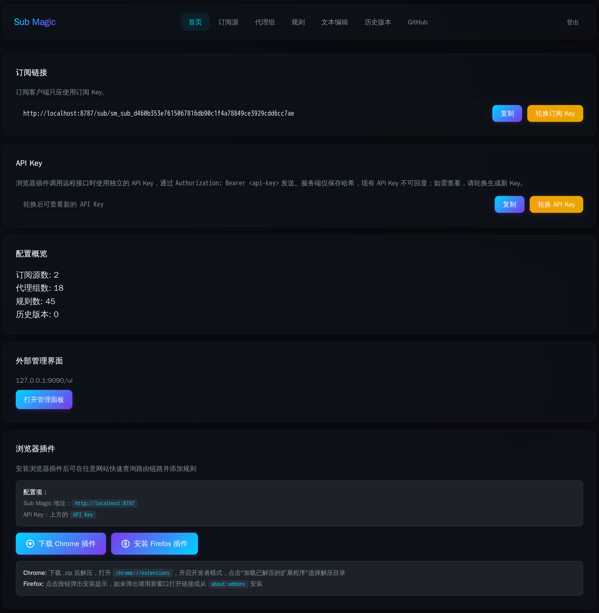
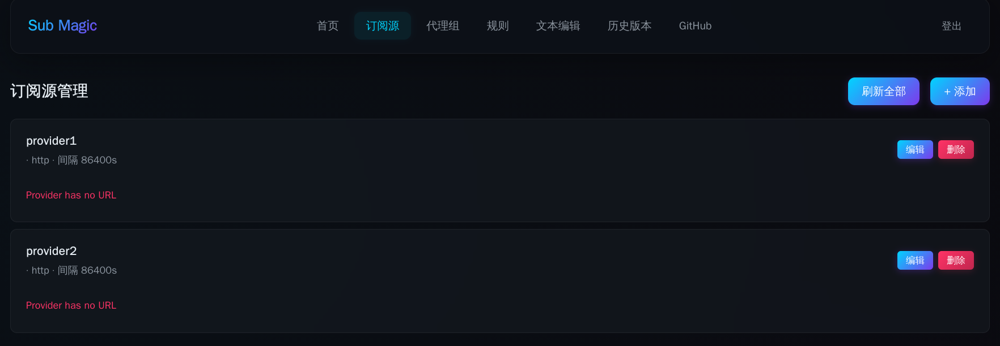
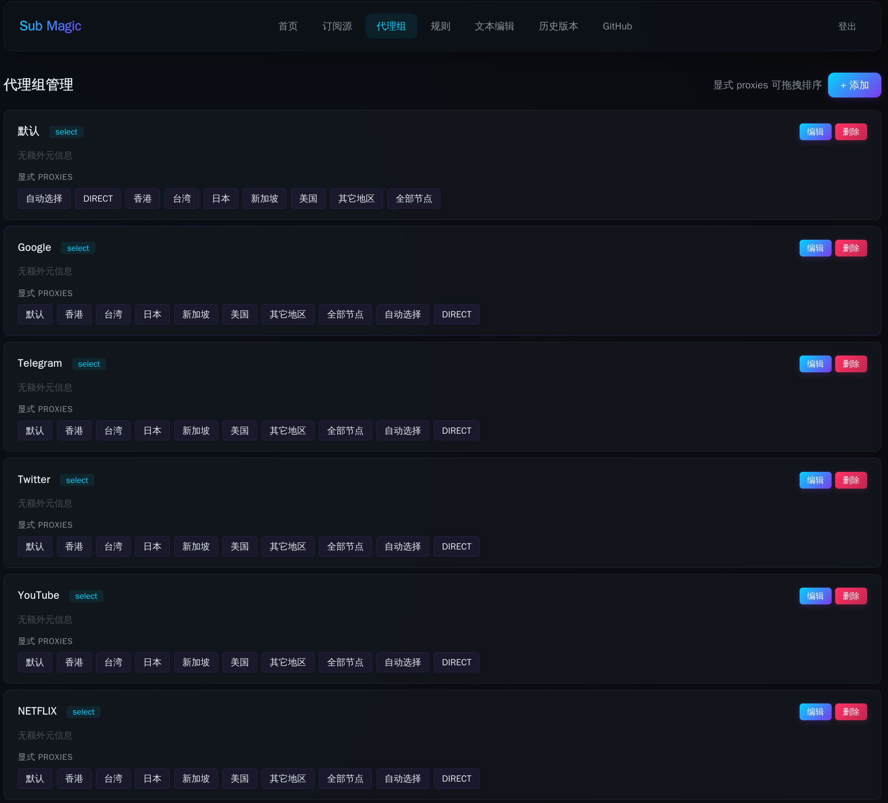
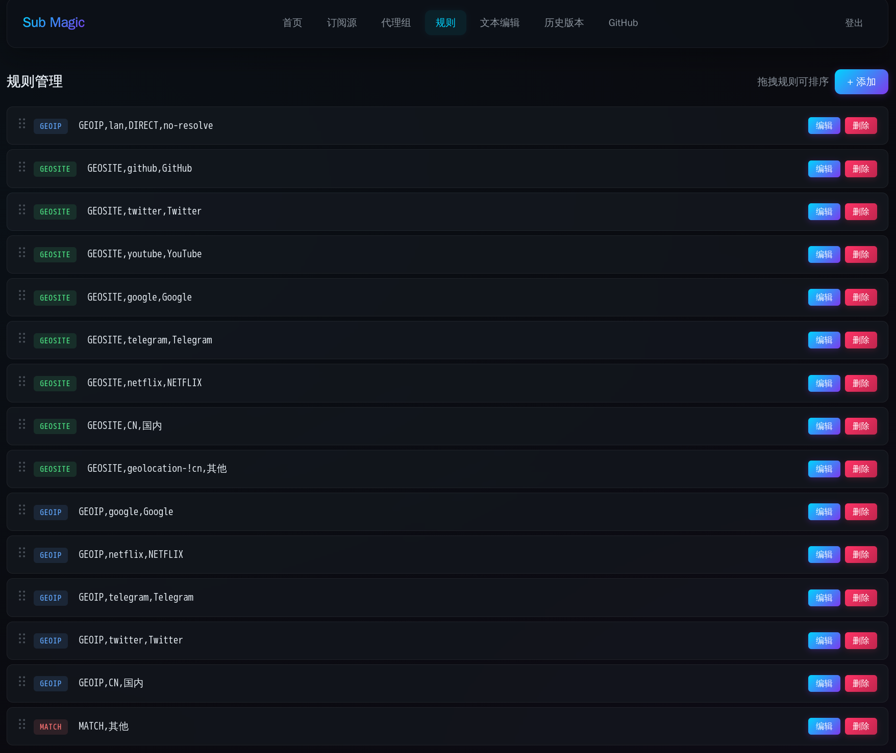
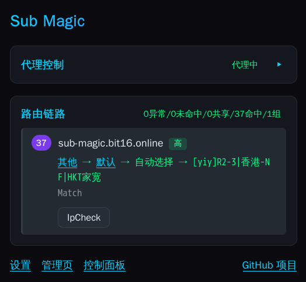
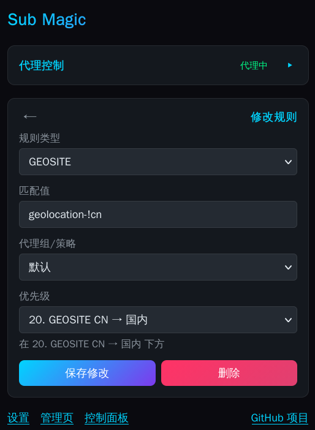
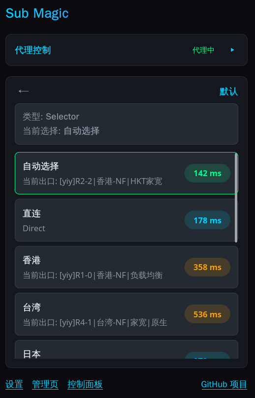
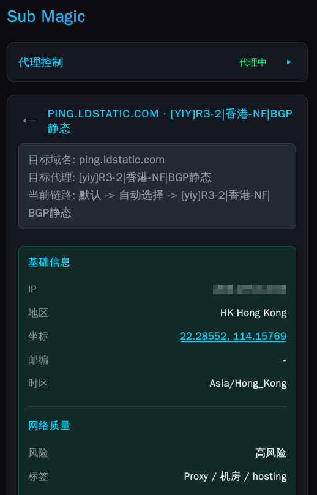

# Sub Magic

English README | [中文说明](./README.md)

Sub Magic is a Mihomo/Clash Meta configuration management tool built on Cloudflare Workers. It provides a web admin panel, a key-protected subscription distribution endpoint, and a companion browser extension for inspecting the current site's routing chain, switching proxy paths, running IP checks, and quickly writing rules back to local Mihomo or the remote Worker.

## Planned / Known Issues

- [x] Use Durable Objects to provide faster subscription sync responses
  > Completed. Configuration storage has been migrated to a SQLite-backed Durable Object, providing strongly-consistent reads/writes and WebSocket real-time push.

## Features

- Subscription hosting: the full configuration is stored in a SQLite-backed Durable Object and exposed as a YAML subscription via `/sub/{key}`.
- Web admin panel: password-based login with an SPA management interface, with multi-tab real-time sync.
- Subscription source management: manage `proxy-providers` with create/update/delete, UA settings, health check fields, usage queries, and refresh support.
- Proxy group management: manage `proxy-groups`, including `select`, `url-test`, `fallback`, `load-balance`, and `relay`, with explicit members, provider-based `use`, `include-all` variants, and filters.
- Rule management: manage `rules` with drag-and-drop sorting and support for common rule types, logical rules, `RULE-SET`, `SUB-RULE`, `MATCH`, and more.
- GeoSite / GeoIP selectors: parse `geosite.dat` and `geoip.dat` in the browser to help fill rule targets.
- YAML text editing: edit the full configuration directly.
- Version history: save, inspect, restore, and delete configuration snapshots (DO SQLite storage).
- Real-time config sync: WebSocket long-lived connection push; after any client modifies the configuration, all other logged-in tabs auto-refresh.
- Subscription key management: view and rotate access keys.
- Browser extension: inspect the current page's matched routing path, switch selector groups, control default proxy and auth user, run IP checks, and quickly add or update rules.

## Admin Panel

- Home: subscription link, key rotation, configuration overview, and version history count.
- Subscription sources: list view, form editing, per-source refresh, batch refresh, usage progress bars, and expiration details.
- Proxy groups: list view, form editing, and drag-and-drop ordering for explicit `proxies`.
- Rules: list view, form editing, drag-and-drop ordering, and GeoSite/GeoIP selectors.
- Text editor: direct full-YAML editing.
- Version history: save, inspect, restore, and delete.

## Browser Extension

- Reads route information for the current page and shows the matched rule, target domain, proxy chain, and editable rule entry.
- Switches the current selection of selector / url-test / fallback groups, then tries to close existing connections and reload the page for validation.
- Manages default proxy port, proxy type, and proxy auth user. Firefox supports per-tab proxy isolation, while Chrome uses a global proxy.
- Runs IP checks for exit IP, risk labels, geolocation, and availability of ChatGPT, Claude, Gemini, Netflix, Disney+, Prime Video, and YouTube Premium.
- Calls both the local Mihomo API and the remote Sub Magic API to quickly add, update, or delete rules, with priority control and GeoSite / GeoIP suggestions.

## UI Preview










## Architecture

```text
Browser / Browser Extension
        |
        |-- WS /api/sync ---------------|
        v                               v
Cloudflare Worker           ConfigSync Durable Object
  |- Static admin assets     |- config (SQLite)
  |- API                     |- versions (SQLite)
  `- /sub/{key} output       `- WebSocket broadcast
        |
        v
Cloudflare KV
  |- subscription_key
  |- api_key_hash
  |- password_hash
  |- session:*
  `- (config and versions as fallback)
```

## Tech Stack

- Cloudflare Workers
- Cloudflare KV (auth, sessions, keys)
- **Cloudflare Durable Objects (SQLite-backed)** — primary config storage and real-time sync
- WebSocket Hibernation API
- Native ES Modules frontend
- `yaml`
- Vitest + `@cloudflare/vitest-pool-workers`
- Manifest V3 browser extension (Firefox / Chromium)

## Quick Start

### Requirements

- Node.js 18+
- A Cloudflare account

### Fork This Project

Click the **Fork** button at the top of the [GitHub](https://github.com/bit8192/sub-magic) page.

### Deploy to Cloudflare

1. Sign in to [Cloudflare](https://www.cloudflare.com/).
2. In the left sidebar, go to **Compute** -> **Workers and Pages**.
3. Click **Create application**.
4. Click **Continue with GitHub**.
5. Select **Sub Magic** and continue.
6. Enter the build command `npm run build:extension` to build the browser extension.
   > If you only plan to install a signed extension or publish it through an extension store, you can skip this step. You can also apply for a developer account and configure signing keys for signed builds.
7. Deploy the project.
8. **Bind Durable Object**
   - On the Worker detail page, click **Bindings**.
   - Click **Add binding**, select **Durable Object**, enter variable name `CONFIG_SYNC`, and select class name `ConfigSync`.
   - Save the binding (the `migrations` in `wrangler.jsonc` will automatically create the SQLite-backed DO on first deploy).
9. **Bind Workers KV**
   - In the left sidebar, go to **Storage & Databases** -> **Workers KV**.
   - Click **Create instance**, enter a KV namespace name such as `SUB_MAGIC`.
   - Return to the Worker detail page, click **Bindings** -> **Add binding**.
   - Choose a KV namespace binding, set the variable name to `SUB_MAGIC`, select the namespace you just created, and save it.
10. Open the Worker URL from the top-right corner.

### Install the Browser Extension

- Chrome extension
  The extension is not published to the Chrome Web Store.
  - Download it from the admin page, or build it locally with `npm run build:extension`.
  - Extract it with `unzip public/extensions/sub-magic-chrome.zip`.
  - Enable developer mode in Chrome and load the extracted extension.
- Firefox extension
  Search for `Sub Magic` in the Firefox add-ons store, or build it yourself:
  - Run `npm run build:extension` to build it, or download the Firefox extension from the admin home page.
  - Open `about:config`.
  - Set `xpinstall.signatures.required` to `false`.
  - In the add-ons page, choose **Install Add-on From File** and select `public/extensions/sub-magic-firefox.xpi`.

### Install Mihomo and the Auto-Update Script

> If you need to change the domain, update it first and then copy the install script from the site using that final domain.

You can copy platform-specific install scripts directly from the admin home page. The scripts default to the Cloudflare-hosted subscription endpoint.

> On Windows, the script automatically installs the Mihomo service and enables auto-start.

> On Linux, the script does not auto-install Mihomo because packaging differs across distributions. For Arch Linux, you can install it with `sudo pacman -S mihomo` and then enable the Mihomo service.

### Local Development

```bash
npm run dev
```

Common commands:

```bash
npm run dev
npm run deploy
npm run test
npm run cf-typegen
```

### Deployment

```bash
npm run deploy
```

On first startup, the Worker initializes the default configuration and access key in KV automatically. The admin password no longer depends on a pre-seeded environment variable; it is written into KV from the page during the first visit.

## Usage

### Admin Login

Open the deployed Worker URL:

- If the admin password has not been initialized, the page asks you to set a new password with at least 6 characters and then logs you in automatically.
- If the password is already initialized, log in with that password.
- If this is an upgraded instance from an older version and first-time password setup has not been completed, you can still log in with the `PASSWORD` secret.

### Subscription URL

The home page shows the current subscription URL:

```text
https://your-worker.example.com/sub/{key}
```

You can use it directly in Mihomo / Clash Meta clients.

The subscription endpoint supports standard `ETag / If-None-Match` conditional requests:

- A normal request to `/sub/{key}` returns the current result immediately.
- If the configuration has not changed, the Worker returns `304 Not Modified`.
- If the configuration has changed, the Worker returns `200` with the latest YAML.

### Linux Auto Update

The home page provides a Linux install command that sets up a user-level systemd timer and update script.

- The timer runs every `30s`.
- The update script sends `If-None-Match` and the dedicated header `X-Sub-Magic-Long-Poll: 1`.
- The Worker only enables **Durable Object strongly-consistent long-polling** for requests with that header.
- When the client's `ETag` matches the current config, the DO checks the config state every `3s` for up to `10` times, for a total wait of about `30s`.
- Because configuration is stored in a SQLite-backed DO, reads are strongly consistent and configuration changes can be detected immediately, returning the latest YAML right away.
- If nothing changes before the wait ends, it returns `304`, and the client retries on the next timer tick.

### Windows Auto Update

The home page also provides a Windows install command. The script runs the following steps in the current working directory:

- Checks whether a Mihomo service already exists.
- If not, checks whether `mihomo*.exe` already exists in the current directory.
- If still missing, prompts to resolve the latest stable release from `https://github.com/MetaCubeX/mihomo/releases`, download the Windows archive for the current architecture, and extract `mihomo.exe` into the current directory.
- Then asks whether to install the Mihomo service.
- Finally downloads `sub-magic.ps1` into the current directory and registers a Windows scheduled task named `sub-magic` that runs once per minute.

Like Linux, the Windows update script sends `If-None-Match` and `X-Sub-Magic-Long-Poll: 1`. When the configuration changes, it overwrites the local config file and tries to trigger a reload through `external-controller` first; if the API is unavailable, it falls back to restarting the Mihomo service.

### Rule Write API

In addition to the admin panel, the service exposes two endpoints for the browser extension:

- `POST /api/rules/add`
- `POST /api/rules/update`

They use the access key to write rules and do not require an admin session.

## Browser Extension

The repository includes a browser extension in [browser-extension](./browser-extension), which can build Firefox and Chromium artifacts.

Build the extension:

```bash
npm run build:extension
```

Build it inside the extension directory:

```bash
cd browser-extension
npm install
npm run build
```

For Firefox signing, see [browser-extension/.env.example](./browser-extension/.env.example).

## Project Structure

```text
src/
  api.ts                          Worker API
  auth.ts                         Login and session
  config.ts                       Config and version management (DO primary, KV fallback)
  subscribe.ts                    Subscription output
  subscription-info.ts            Subscription usage lookup
  yaml.ts                         Config and rule parsing/serialization
  durable-objects/
    config-sync.ts                ConfigSync Durable Object (SQLite + WS)

public/
  index.html
  style.css
  js/
    app.js
    api.js
    auth.js
    router.js
    state.js
    sync.js                         WebSocket real-time sync client
    utils.js
    views/
    parsers/

browser-extension/
  src/background/
  src/popup/
  src/options/
```

## API Overview

Authentication and session:

- `POST /api/login`
- `POST /api/logout`
- `GET /api/check`

Real-time sync (WebSocket):

- `GET /api/sync` — establish WebSocket connection, receive `config:updated` / `config:sync` events

Configuration and subscription:

- `GET /api/config`
- `PUT /api/config`
- `GET /api/config/meta`
- `GET /sub/{key}`

Subscription sources:

- `GET/POST /api/config/proxy-providers`
- `PUT/DELETE /api/config/proxy-providers/{name}`
- `POST /api/subscription-info`

Proxy groups:

- `GET/POST /api/config/proxy-groups`
- `PUT/DELETE /api/config/proxy-groups/{name}`

Rules:

- `GET/POST/PUT /api/config/rules`
- `PUT/DELETE /api/config/rules/{index}`
- `POST /api/rules/add`
- `POST /api/rules/update`

Versions and keys:

- `GET/POST /api/config/versions`
- `GET/DELETE /api/config/versions/{id}`
- `POST /api/config/versions/{id}/restore`
- `GET /api/access-key`
- `POST /api/access-key/rotate`

## Configuration Reference

The project follows the Mihomo configuration format. See:

- [General](https://wiki.metacubex.one/config/general/)
- [Proxy Providers](https://wiki.metacubex.one/config/proxy-providers/)
- [Proxy Groups](https://wiki.metacubex.one/config/proxy-groups/)
- [Rules](https://wiki.metacubex.one/config/rules/)

The repository also includes a more complete example file: [full-config-demo.yaml](./full-config-demo.yaml).

## Testing

```bash
npm run test
```

If you change Worker bindings or runtime settings, testing depends on local Wrangler/Miniflare support.

## License

MIT

## Links

- [LINUX DO Community](https://linux.do)
