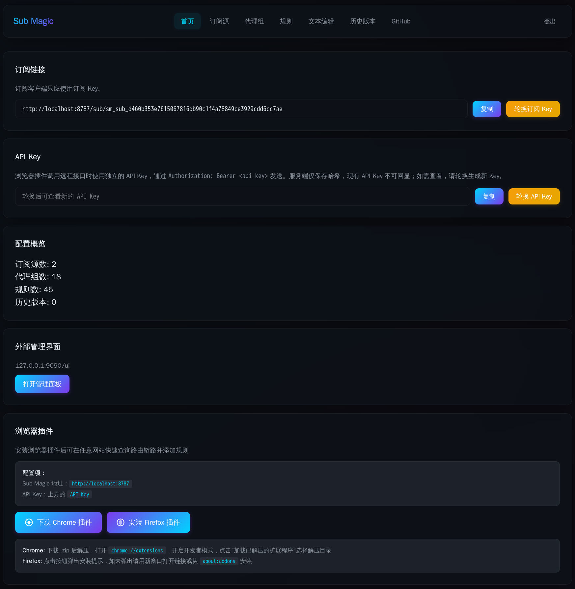
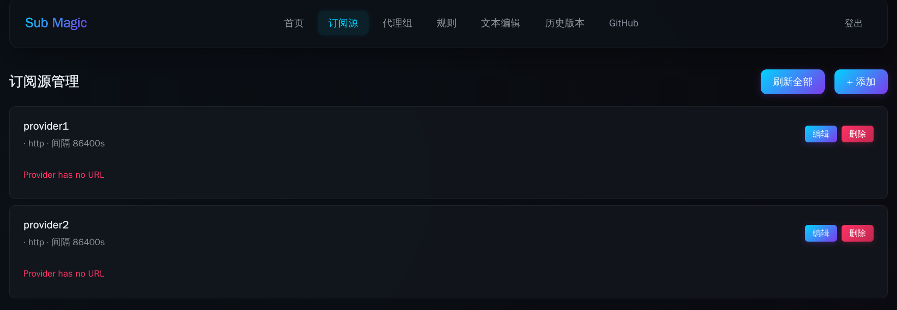
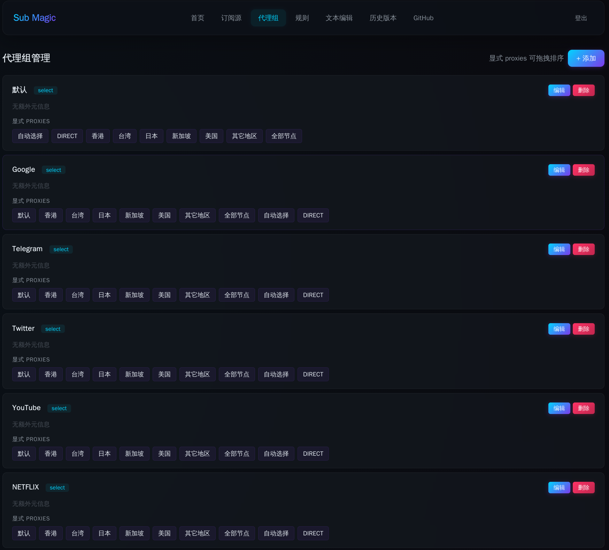
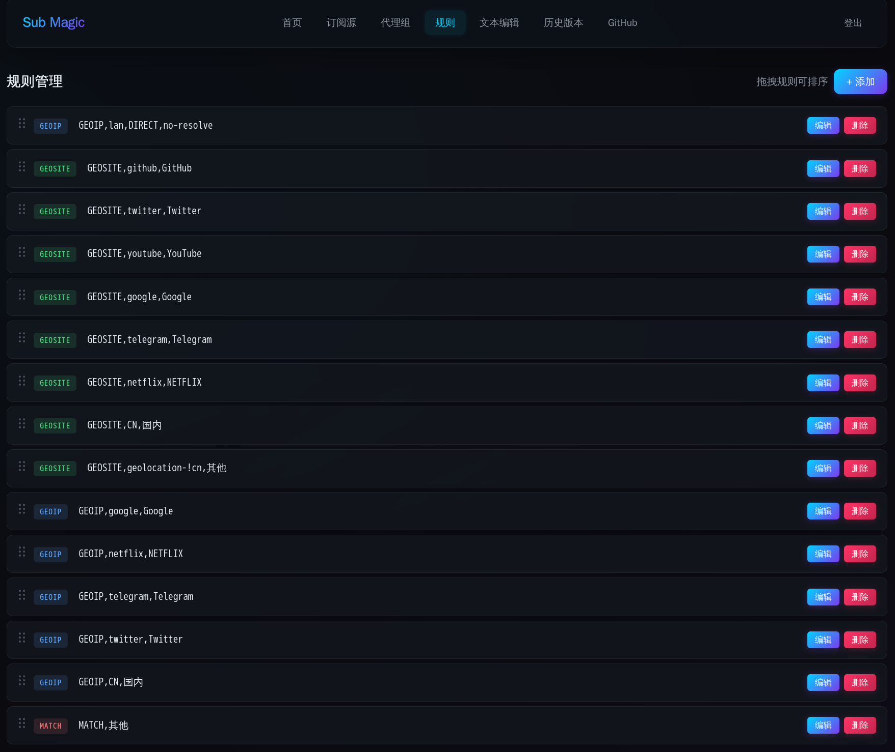
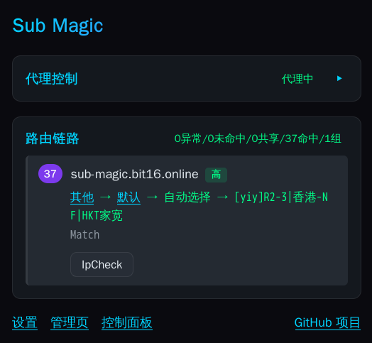
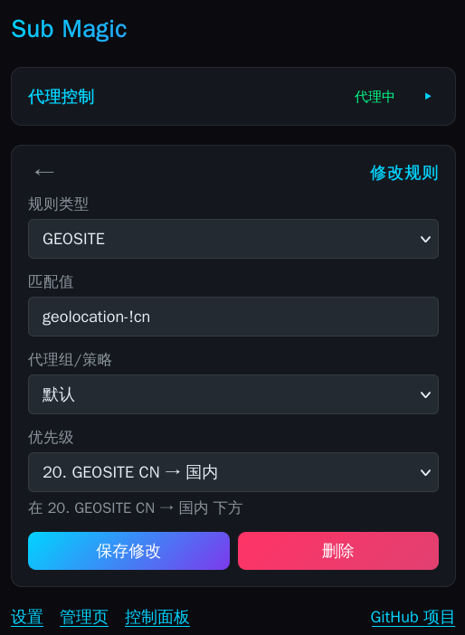
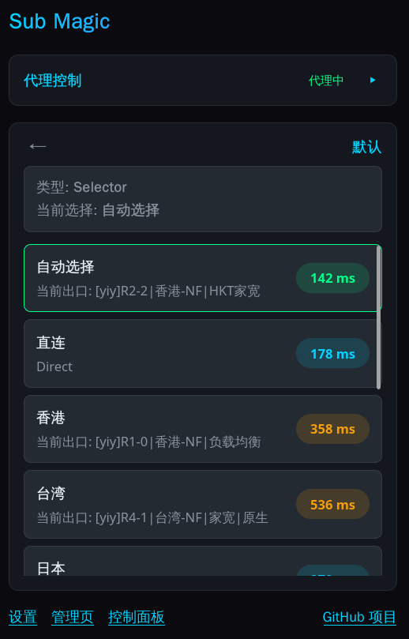
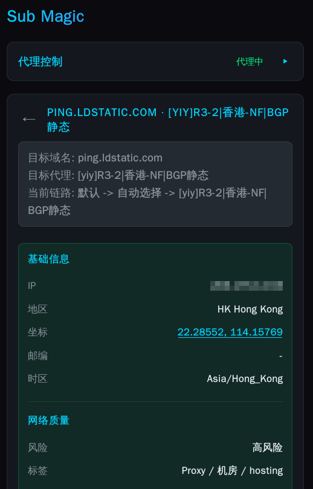

# Sub Magic

[English README](./README.en.md) | 中文说明

Sub Magic 是一个运行在 Cloudflare Workers 上的 Mihomo/Clash Meta 配置管理工具。它提供 Web 管理界面、受 Key 保护的订阅分发接口，以及一个配套浏览器扩展，用于查看当前站点的路由链路、切换代理链路、执行 IpCheck，并把规则快速回写到本地 Mihomo 或远端 Worker。

## 待实现/缺陷

- [ ] 使用DurableObject实现更快的订阅同步响应
	> 为了降低Cloudflare配置复杂度使用KV重复读取判断KV更新，现在的同步延迟约为15-30s甚至更高，后期看看用户使用反馈再考虑实现

## 功能概览

- 订阅配置托管：完整配置保存在 Cloudflare KV，通过 `/sub/{key}` 输出 YAML 订阅。
- Web 管理后台：基于密码登录，支持 SPA 管理界面。
- 订阅源管理：管理 `proxy-providers`，支持增删改、UA 设置、健康检查字段、用量查询与刷新。
- 代理组管理：管理 `proxy-groups`，支持 `select`、`url-test`、`fallback`、`load-balance`、`relay`，支持显式成员、`use` provider、`include-all` 系列与过滤项。
- 规则管理：管理 `rules`，支持拖拽排序、常见规则类型、逻辑规则、`RULE-SET`、`SUB-RULE`、`MATCH` 等。
- GeoSite / GeoIP 选择器：浏览器端解析 `geosite.dat` / `geoip.dat`，辅助回填规则。
- YAML 文本编辑：直接编辑完整配置文本。
- 历史版本管理：保存、查看、恢复、删除配置快照。
- 订阅 Key 管理：查看与轮换访问 Key。
- 浏览器扩展：查看当前页面命中的路由链路，切换策略组 selector，控制默认代理与代理认证用户，执行 IpCheck，并快速新增/更新规则。

## 管理后台能力

- 首页：订阅链接、Key 轮换、配置概览、历史版本计数。
- 订阅源：列表、表单编辑、单源刷新、批量刷新、用量进度条与到期信息。
- 代理组：列表、表单编辑、显式 `proxies` 拖拽排序。
- 规则：列表、表单编辑、拖拽排序、GeoSite/GeoIP 选择器。
- 文本编辑：直接修改完整 YAML。
- 历史版本：保存、查看、恢复、删除。

## 浏览器插件能力

- 读取当前页面相关路由信息，展示命中的规则、目标域名、代理链路与可编辑规则项。
- 切换 selector / url-test / fallback 等代理组当前选择，并尝试关闭现有连接后刷新页面验证。
- 管理默认代理端口、代理类型、代理认证用户；Firefox 支持按标签页代理隔离，Chrome 使用全局代理。
- 执行 IpCheck，检测出口 IP、风险标签、地理信息，以及 ChatGPT、Claude、Gemini、Netflix、Disney+、Prime Video、YouTube Premium 等可用性。
- 调用本地 Mihomo API 与远端 Sub Magic API，快速新增、更新、删除规则，并支持优先级位置控制与 GeoSite / GeoIP 建议。


## 界面预览









## 架构

```text
浏览器 / 浏览器扩展
        │
        ▼
Cloudflare Worker
  ├─ 管理界面静态资源
  ├─ API
  └─ /sub/{key} 订阅输出
        │
        ▼
Cloudflare KV
  ├─ config
  ├─ subscription_key
  ├─ api_key_hash
  ├─ session:*
  └─ versions:*
```

## 技术栈

- Cloudflare Workers
- Cloudflare KV
- 原生 ES Modules 前端
- `yaml`
- Vitest + `@cloudflare/vitest-pool-workers`
- Manifest V3 浏览器扩展（Firefox / Chromium）

## 快速开始

### 前置要求

- Node.js 18+
- Cloudflare 账户

### Fork 本项目
在 [Github](https://github.com/bit8192/sub-magic) 页面中点击上方Fork按钮

### 部署到Cloudflare

1. 登录 [Cloudflare](https://www.cloudflare.com/)
2. 左侧面板点击**计算**->**Worker 和 Pagges**
3. 点击**创建应用程序**
4. 点击**Continue with Github**
5. 选择**Sub Magic**然后下一步
6. 输入构建命令`npm run build:extension`构建浏览器扩展
    > 若你需要安装签名的插件或在插件市场进行安装可以忽略这一步，或者你可以申请开发者并配置密钥进行签名构建
7. 点击部署
8. 点击左侧导航栏**存储和数据库**->**Workers KV**
9. 点击**Create Isntance**
10. 输入KV命名空间，如`SUB_MAGIC`
11. 返回**计算**->**Worker 和 Pagges**
12. 选择刚才部署的Worker
13. 点击**绑定**
14. 点击**添加绑定**
15. 选择KV命名空间，然后点击添加绑定
16. 输入变量名称`SUB_MAGIC`并选择刚才创建的命名空间，然后点击添加绑定
17. 然后点击右上角访问即可

### 安装浏览器插件

- Chrome 插件
	由于本人财力不足，创建Chrome开发者需要$5，所以并没有发布到Chrome
  - 在管理页面中点击下载Chrome插件，或者clone本项目到本地进行编译`npm run build:extension`
  - 解压插件`unzip public/extensions/sub-magic-chrome.zip`
  - 在浏览器中打开开发者模式，然后加载刚才解压的插件即可
- Firefox 插件
    在插件市场搜索Sub Magic安装，或者自行编译：
  - 执行命令`npm run build:extension`编译插件/在管理首页下载Firefox插件
  - 在浏览器中输入`about:config`进入配置页面
  - 搜索并将`xpinstall.signatures.required`设置为`false`
  - 在插件管理页中选择**从文件安装附加插件**选择public/extensions/sub-magic-firefox.xpi进行安装即可

### 安装Mihomo服务和自动更新脚本

> 若你需要修改域名请修改域名后再通过域名访问复制安装脚本

在管理首页即可复制对应平台的安装脚本进行安装，脚本会默认配置Clouudflare后端的订阅地址

> 对于Windows用户脚本会自动安装Mihomo服务并设置自动启动

> Linux平台不会自动安装Mihomo服务，因为发行版本太多不一定有Mihomo的应用包也为了避免污染Linux系统 ~~（其实就是懒）~~，不过如果你是Archlinux用户你可以通过
> `sudo pacman -S mihomo`进行安装并启用mihomo服务

### 本地开发

```bash
npm run dev
```

常用命令：

```bash
npm run dev
npm run deploy
npm run test
npm run cf-typegen
```

### 部署

```bash
npm run deploy
```

首次启动时，Worker 会在 KV 中自动初始化默认配置和访问 Key。管理后台密码不再依赖预先写入环境变量，而是在首次访问时由页面写入 KV。

## 使用说明

### 登录后台

部署后访问 Worker 域名：

- 如果后台密码尚未初始化，页面会先要求设置一个不少于 6 位的新密码，并自动登录。
- 如果后台密码已初始化，使用该密码登录。
- 如果这是旧版本升级实例，且尚未完成首次页面设密，仍可继续使用 `PASSWORD` secret 登录。

### 订阅链接

首页会显示当前订阅链接：

```text
https://your-worker.example.com/sub/{key}
```

可直接填入 Mihomo / Clash Meta 客户端。

订阅接口支持标准 `ETag / If-None-Match` 条件请求：

- 普通客户端请求 `/sub/{key}` 时，Worker 会立即返回结果。
- 配置未变化时返回 `304 Not Modified`。
- 配置有变化时返回 `200` 和最新 YAML 内容。

### Linux 自动更新

首页提供 Linux 安装命令，会安装一个 systemd 用户级定时器与更新脚本。

- 定时器固定每 `30s` 触发一次。
- 更新脚本请求订阅时会携带 `If-None-Match` 和专用请求头 `X-Sub-Magic-Long-Poll: 1`。
- Worker 仅对带该请求头的请求启用 KV 伪长轮询。
- 当客户端 `ETag` 与当前配置一致时，Worker 会每 `3s` 检查一次 KV，最多检查 `10` 次，总等待约 `30s`。
- 在等待期间如果检测到配置变化，会立即返回 `200` 和最新 YAML。
- 如果等待结束仍无变化，则返回 `304`，客户端在下一次定时触发时继续请求。

这种实现依赖 Cloudflare KV 读取来近似长轮询，适合个人使用场景；如果后续需要更稳定的“更新即返回”语义，可再迁移到 Durable Objects。

### Windows 自动更新

首页也提供 Windows 安装命令。安装脚本会在当前工作目录执行以下流程：

- 检测系统中是否已存在 Mihomo 服务。
- 如果不存在，再检查当前目录是否已有 `mihomo*.exe`。
- 如果仍不存在，会询问是否尝试解析 `https://github.com/MetaCubeX/mihomo/releases` 的最新稳定版并下载适配当前架构的 Windows 压缩包，随后将 `mihomo.exe` 解压到当前目录。
- 然后询问是否安装 Mihomo 服务。
- 最后下载 `sub-magic.ps1` 到当前目录，并注册名为 `sub-magic` 的 Windows 计划任务，每 1 分钟执行一次更新脚本。

Windows 更新脚本与 Linux 一样会携带 `If-None-Match` 和 `X-Sub-Magic-Long-Poll: 1`。当配置变更时，脚本会覆盖本地配置文件，并优先通过 `external-controller` 调用 Mihomo API 触发重载；若 API 不可用，则退回到重启 Mihomo 服务。

### 规则快速写入 API

除后台外，服务还提供两个给浏览器扩展使用的接口：

- `POST /api/rules/add`
- `POST /api/rules/update`

它们基于访问 Key 写入规则，无需后台会话。

## 浏览器扩展

仓库包含一个浏览器扩展，目录为 [browser-extension](./browser-extension)，可构建 Firefox 与 Chromium 两个产物。

构建扩展：

```bash
npm run build:extension
```

扩展内部单独构建：

```bash
cd browser-extension
npm install
npm run build
```

如需 Firefox 签名，可参考 [browser-extension/.env.example](./browser-extension/.env.example)。

## 项目结构

```text
src/
  api.ts                Worker API
  auth.ts               登录与会话
  config.ts             KV 配置/版本管理
  subscribe.ts          订阅输出
  subscription-info.ts  订阅源用量查询
  yaml.ts               配置与规则解析/序列化

public/
  index.html
  style.css
  js/
    app.js
    api.js
    auth.js
    router.js
    state.js
    utils.js
    views/
    parsers/

browser-extension/
  src/background/
  src/popup/
  src/options/
```

## API 概览

认证与会话：

- `POST /api/login`
- `POST /api/logout`
- `GET /api/check`

配置与订阅：

- `GET /api/config`
- `PUT /api/config`
- `GET /api/config/meta`
- `GET /sub/{key}`

订阅源：

- `GET/POST /api/config/proxy-providers`
- `PUT/DELETE /api/config/proxy-providers/{name}`
- `POST /api/subscription-info`

代理组：

- `GET/POST /api/config/proxy-groups`
- `PUT/DELETE /api/config/proxy-groups/{name}`

规则：

- `GET/POST/PUT /api/config/rules`
- `PUT/DELETE /api/config/rules/{index}`
- `POST /api/rules/add`
- `POST /api/rules/update`

版本与 Key：

- `GET/POST /api/config/versions`
- `GET/DELETE /api/config/versions/{id}`
- `POST /api/config/versions/{id}/restore`
- `GET /api/access-key`
- `POST /api/access-key/rotate`

## 配置格式参考

项目以 Mihomo 配置格式为准，可参考：

- [General](https://wiki.metacubex.one/config/general/)
- [Proxy Providers](https://wiki.metacubex.one/config/proxy-providers/)
- [Proxy Groups](https://wiki.metacubex.one/config/proxy-groups/)
- [Rules](https://wiki.metacubex.one/config/rules/)

本仓库还提供一个较完整的示例文件：[full-config-demo.yaml](./full-config-demo.yaml)。

## 测试

```bash
npm run test
```

如果你调整了 Worker 绑定或运行环境，测试依赖 Wrangler/Miniflare 的本地运行能力。

## License

MIT

## 友情链接

- [LINUX DO 社区](https://linux.do)
